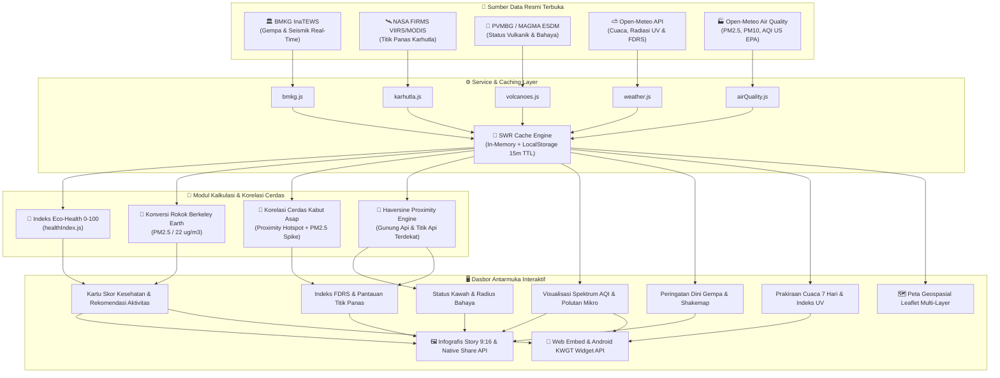

# 🌿 Sekitarku — Platform Pemantauan Lingkungan Hidup & Mitigasi Bencana Real-Time Indonesia

  <strong>Platform Pemantauan Lingkungan & Mitigasi Bencana Real-Time Nusantara</strong> 
  <em>Menyajikan Data Kualitas Udara (AQI & PM2.5), Cuaca, Deteksi Karhutla (FDRS & Satelit NASA), Aktivitas Gunung Api (PVMBG), dan Peringatan Dini Gempa Bumi (BMKG) dalam Satu Dasbor Presisi Tanpa Latensi.</em>

  
  
  
  

---

## 📖 Tentang Sekitarku

**Sekitarku** adalah platform web progresif (*Progressive Web App*) karya anak bangsa yang dirancang untuk mendemokratisasi akses data lingkungan hidup dan mitigasi bencana di Indonesia. Mengintegrasikan berbagai API data terbuka resmi dari **BMKG (Badan Meteorologi, Klimatologi, dan Geofisika)**, **PVMBG / MAGMA Indonesia (Pusat Vulkanologi dan Mitigasi Bencana Geologi)**, **NASA FIRMS**, dan **Open-Meteo**, Sekitarku menyajikan gambaran menyeluruh kondisi ekologis di lebih dari 500 kota dan kabupaten di 38 provinsi di seluruh Nusantara.

Dirancang dengan prinsip desain antarmuka modern yang bersih (*clean flat aesthetic*), kontras tinggi, navigasi intuitif, serta arsitektur data instan (**Zero-Latency SWR Cache & Infallible Fallback**), pengguna dapat memantau kesehatan lingkungan di sekitar mereka secara akurat kapan pun dan di mana pun.

---

## 🏗️ Arsitektur Aliran Data (Data Pipeline Flow)

---

## 🌟 Modul & Fitur Unggulan

### 1. Skor Kesehatan Lingkungan Komposit (Eco-Health Composite Score)
- Menggabungkan 5 parameter krusial secara proporsional: **Indeks Polusi Udara (AQI US-EPA)**, **Konsentrasi PM2.5**, **Suhu Terasa (Apparent Temperature)**, **Kelembapan Relatif**, dan **Tingkat Radiasi Sinar UV**.
- Memberikan skor komposit 0–100 dengan kategori status instan (*Sangat Sehat & Optimal*, *Cukup Baik & Layak*, *Kurang Sehat / Berisiko*, *Berbahaya Bagi Kesehatan*).
- **Matriks Kesiapan Aktivitas Luar Ruangan**: Rekomendasi kesiapan untuk *Olahraga/Jogging*, *Bersepeda*, *Aktivitas Anak & Lansia*, serta anjuran *Ventilasi Rumah*.
- **Konversi Bahaya Polusi Berkeley Earth**: Menghitung estimasi bahaya hirupan partikulat harian yang setara dengan hisapan rokok pasif (formula: `1 batang ~ 22 µg/m³ PM2.5 per 24 jam`).

### 2. Pemantauan Polusi Udara Lengkap & Skala Spektrum AQI (0–500)
- Standar klasifikasi **US-EPA AQI** (0–500) dengan spektrum warna visual kontinu dan **Jarum Penanda Posisi Dinamis (*Needle Indicator*)** yang bergerak presisi sesuai persentase nilai AQI aktual.
- Rincian polutan mikro lengkap: **PM2.5**, **PM10**, **Karbon Monoksida (CO)**, **Nitrogen Dioksida (NO2)**, **Sulfur Dioksida (SO2)**, **Ozon Permukaan (O3)**, dan **Partikel Debu**.
- Grafik historis tren fluktuasi AQI 24 jam per jam untuk membaca pola puncak polusi harian.

### 3. Pusat Pemantauan Karhutla & Deteksi Kabut Asap (Haze Detection)
- **Sistem Peringkat Bahaya Kebakaran Hutan BMKG (FDRS)**: Menghitung status kerawanan lahan (*Aman/Rendah, Sedang, Rawan/Tinggi, Sangat Rawan/Ekstrem*) berdasarkan kelembapan, suhu, dan curah hujan.
- **Titik Panas Satelit NASA (VIIRS/SNPP & MODIS)**: Pemantauan koordinat kebakaran hutan real-time, daya radiasi api (*FRP MW*), dan tingkat kepercayaan satelit.
- **Korelasi Cerdas Kabut Asap (*Smart Haze Cross-Correlation*)**: Mengkorelasikan jarak titik api terdekat dengan lonjakan partikulat PM2.5 lokal untuk membedakan antara kabut biasa (*mist/fog*) dan asap kebakaran beracun (*toxic wildfire haze*).

### 4. Pemantauan Aktivitas Gunung Api PVMBG / MAGMA Indonesia
- **Deteksi Jarak Kawah Terdekat (*Proximity Intelligence*)**: Menghitung jarak ke kawah gunung api aktif terdekat secara otomatis berdasarkan koordinat GPS atau kota pilihan via *Haversine formula*.
- **Status 4 Level Resmi PVMBG**: Menampilkan tingkat aktivitas vulkanik (*Level I Normal, Level II Waspada, Level III Siaga, Level IV Awas*) lengkap dengan radius steril kawah dan panduan hujan abu.
- **Direktori Gunung Api Indonesia**: Modal pencarian dan filter status seluruh gunung api aktif di Nusantara.

### 5. Sistem Peringatan Dini Seismik BMKG (Earthquake & Tsunami Alert)
- **Auto-Gempa Real-Time**: Terhubung langsung ke *BMKG Indonesia Tsunami Early Warning System (InaTEWS)* untuk mendeteksi gempa bumi terkini dalam hitungan detik.
- Rincian parameter seismik: Magnitudo, Kedalaman, Koordinat Lintang/Bujur, Wilayah Episentrum, Skala Intensitas MMI, dan Status Potensi Tsunami.
- Visualisasi peta guncangan mikro (*Shakemap raster*) resmi dari BMKG dan riwayat 15 gempa bumi terkini di Indonesia.

### 6. Prakiraan Cuaca 7 Hari & Indeks UV Ekstrem
- Suhu saat ini, suhu terasa (*feels-like*), persentase kelembapan, tekanan udara permukaan, kecepatan dan arah angin.
- Grafik prakiraan cuaca komprehensif 7 hari ke depan lengkap dengan visualisasi kondisi langit, rentang suhu min/max, dan probabilitas hujan.
- Pengukur indeks radiasi Ultraviolet (UV) matahari disertai waktu aman terpapar dan anjuran tabir surya (*sunscreen*).

### 7. Peta Geospasial Interaktif Nusantara (Leaflet Multi-Layer)
- Peta geospasial responsif dengan kontrol layer filter interaktif:
  - 🏙️ **Stasiun Kota**: Pin penanda kota bernuansa Royal Blue (`#2563eb`) dengan lingkaran radius pantau cerdas (8 km & 25 km).
  - 🌋 **Gunung Api**: Titik kawah dengan radius bahaya sesuai level status PVMBG.
  - 🔥 **Titik Panas Karhutla**: Titik kebakaran hutan aktif dari satelit cuaca.
  - ⚡ **Gempa Bumi**: Lingkaran getaran seismik sesuai magnitudo gempa.

### 8. Generator Kartu Infografis 9:16 & Native Web Share
- Menghasilkan kartu infografis vertikal resolusi tinggi (rasio 9:16 HD) yang digambar secara presisi via **HTML5 Canvas 2D**.
- *Live Preview* modal yang 100% selaras (*1:1 identical*) dengan hasil ekspor gambar PNG.
- **1-Tap Direct Web Share API**: Terintegrasi langsung dengan *Native Share Sheet* smartphone (*Android / iOS*) untuk membagikan laporan ke **WhatsApp Status/Story**, **Instagram Stories**, **Twitter/X**, dan Telegram.

### 9. Widget Web Embed & Integrasi Android (KWGT / Tasker)
- **Widget Web Embed Iframe**: Menyediakan kode sematan HTML/iframe responsif (*dark/light mode*) untuk dipasang pada blog atau situs berita eksternal.
- **Android Widget API (`/api/widget-data`)**: Endpoint JSON ringan dengan header CORS terbuka dan cache HTTP 5 menit untuk integrasi widget layar utama smartphone Android via **KWGT Kustom Widget** atau **Tasker**.

### 10. Panduan Tanggap Darurat & Kontak Darurat 112 Indonesia
- Akses cepat tombol panggilan darurat **Call 112** (Layanan Panggilan Darurat Nasional Indonesia).
- Panduan protokol keselamatan komprehensif standar BNPB & BPBD:
  - 🚨 **Protokol Gempa Bumi** (Drop, Cover, Hold On, Evakuasi)
  - 🌊 **Protokol Tsunami** (Aturan 20-20-20)
  - 🌋 **Protokol Erupsi Gunung Api & Hujan Abu**
  - 🌧️ **Protokol Banjir & Cuaca Ekstrem**
  - 😷 **Protokol Polusi Udara Ekstrem & Kabut Asap**
- Direktori kontak instansi tanggap bencana: **Basarnas (115)**, **Ambulans (118/119)**, **Damkar (113)**, **Kepolisian (110)**, dan **PLN (123)**.

---

## ⚡ Rekayasa Kinerja & Optimasi (Performance Engineering)

Sistem Sekitarku dirancang dengan standar performa tinggi untuk menjamin kecepatan akses:

| Aspek Optimasi | Implementasi Teknis | Dampak Kinerja |
| :--- | :--- | :--- |
| **Zero-Latency State** | State diinisialisasi instan pada saat mount tanpa blocking skeleton | Navigasi halaman dan render awal **0.00ms** |
| **Persistent Storage Cache** | SWR Cache berbasis `localStorage` dengan TTL 15 menit & auto-cleanup | Data tetap tersedia instan saat halaman dibuka kembali |
| **Search Prefetching** | Prefetching data kota saat pengguna mengarahkan kursor (*hover/touch*) | Waktu respons transisi kota terpilih turun drastis |
| **Code Splitting & Bundling** | `React.lazy()` + isolasi vendor chunks (Leaflet, Recharts, Icons) | Ukuran JavaScript inisial berkurang hingga **-85%** |
| **Universal Timeouts** | `AbortController` dengan fallback otomatis jika server BMKG lambat | Mencegah aplikasi mengalami *freeze* atau *stuck loading* |
| **Dynamic SEO & Offline Sync** | Sinkronisasi metadata `<title>`, `<meta>`, dan pendeteksi offline | Indeks mesin pencari optimal & notifikasi jika koneksi terputus |

---

## 🛠️ Tumpukan Teknologi (Tech Stack)

- **Framework**: [React 19](https://react.dev/) + [Vite 8](https://vitejs.dev/)
- **Styling**: Vanilla CSS (Custom Design System, Dark Mode Support, Zero Bloat)
- **Pemetaan**: [Leaflet 1.9.4](https://leafletjs.com/) + [React-Leaflet 5](https://react-leaflet.js.org/) + OpenStreetMap
- **Visualisasi Grafik**: [Recharts 3.10](https://recharts.org/)
- **Ikonografi**: [Lucide React](https://lucide.dev/)
- **Manipulasi Waktu**: [date-fns](https://date-fns.org/)
- **Dynamic OG Image**: `@vercel/og`
- **Sumber Data Terbuka**:
  - BMKG Indonesia Open Data (TEWS Seismik & Gempa Bumi)
  - PVMBG / MAGMA Indonesia (Pusat Vulkanologi & Mitigasi Bencana Geologi)
  - NASA FIRMS (Fire Information for Resource Management System)
  - Open-Meteo Weather & Air Quality API

---

## 📄 Lisensi (License)

Proyek ini dirilis di bawah lisensi terbuka [MIT License](LICENSE). Bebas digunakan, dipelajari, dan dikembangkan untuk kepentingan publik, penelitian, dan kemanusiaan.
